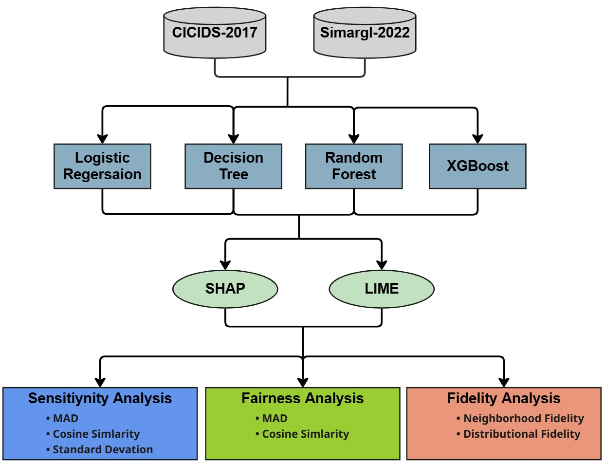

# Beyond Black-Box Detection: A Three-Dimensional Framework for Evaluating Explainable AI in Network Intrusion Detection Systems

## Overview

This repository provides a comprehensive evaluation framework for assessing Explainable AI (XAI) methods in Network Intrusion Detection Systems (IDS). We systematically evaluate SHAP and LIME across three critical dimensions: **sensitivity**, **fairness**, and **fidelity**.

Key finding: No single XAI method universally dominates. Method selection must be model-specific.



## Framework

Our three-dimensional evaluation assesses:

| Dimension | Description | Metrics |
|-----------|-------------|---------|
| **Sensitivity** | Explanation stability under input perturbations | MAD, Cosine Similarity, Standard Deviation |
| **Fairness** | Robustness to sensitive/irrelevant features | Explanation-level bias detection |
| **Fidelity** | Faithfulness to underlying model behavior | Neighborhood Fidelity (NF), Distributional Fidelity (DF) |

## Key Results

- **SHAP**: Near-perfect stability (100% for linear models), superior fairness (Cohen's d up to 5.18)
- **LIME**: Better fidelity for Random Forest (up to 21% improvement)
- All results achieve statistical significance (p < 10⁻¹⁸)

## Datasets

Evaluated on two benchmark IDS datasets:

- **CICIDS-2017**: Canadian Institute for Cybersecurity dataset
- **SIMARGL-2022**: Modern network intrusion dataset

## Classifiers

Four ML classifiers evaluated:
- Logistic Regression (LR)
- Decision Tree (DT)
- Random Forest (RF)
- XGBoost (XGB)

## Requirements

```
numpy
pandas
scikit-learn
shap
lime
scipy
joblib
xgboost
```


## Authors

- **Ismail Bibers** - Purdue University
- **Mustafa Abdallah** - Purdue University

## License

This project is licensed under the MIT License.
